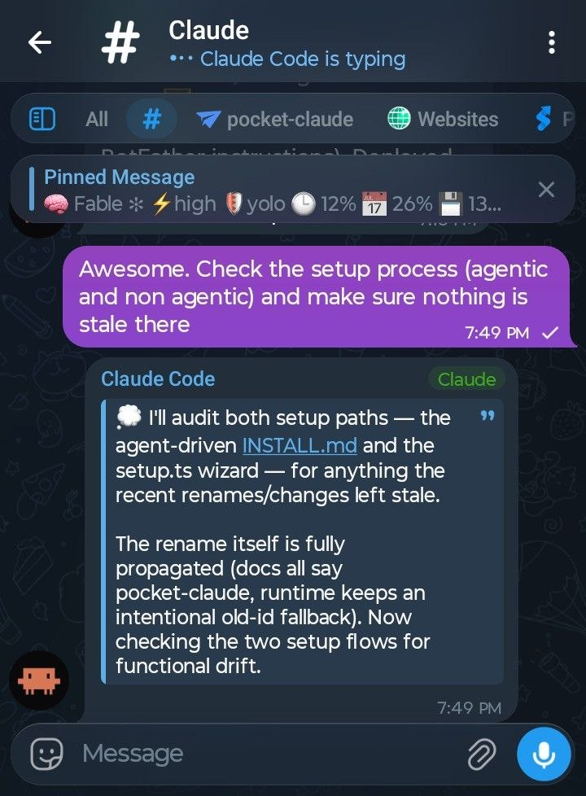

## Claude-tg

Full control of Claude Code through Telegram without ever having to open the terminal. Intuitive design with every feature available in the CLI and some extras.

  

## Requirements

- [Claude Code](https://claude.com/claude-code) installed and logged in.
- [Bun](https://bun.sh) (the runtime; dependencies install on first launch).
- A Telegram bot token from [@BotFather](https://t.me/BotFather).
- `tmux` — required for some features. Core messaging works without it via MCP.
- Linux or macOS (on Windows, run inside [WSL2](https://learn.microsoft.com/windows/wsl/) — native Windows has no `tmux`).

## Installation: 

Start Claude in a tmux session, point it at this repo, and tell it to install it. It will install any dependencies if missing and walk you through setup. 

## Launch

The installer adds the alias claude-tg, which runs Claude with the identifier for the daemon to pick up the session. After going through the initial install, run the alias inside a tmux session, then send a message to the Telegram bot.

For multi-session, add the Telegram bot as an admin with full rights in a Telegram group with topics enabled and send /bind in the general chat. Every new topic you make then opens a new session and lets you specify where it runs. 

## Usage

Once paired, just message your bot — text goes to Claude, and replies come back
formatted. Bot commands:

| Command | What it does |
| --- | --- |
| `/start` | Welcome + full feature guide (and pairing steps if not paired) |
| `/status` | Re-post the pinned status card at the bottom; pairing state if unpaired |
| `/account` | Claude accounts — list, `add <name>`, `remove <name>` (multi-account) |
| `/find <text>` | Search every session's conversation; tap a hit to resume |
| `/queue <prompt>` | Per-session backlog — runs when the session goes idle (`/queue clear`) |
| `/loop <goal>` | Re-run a goal until its check passes (`status` · `stop` · `stop now` · `resume`) |
| `/budget` | Daily $ cap with 80%/100% warnings (`/budget 20` · `off`) |
| `/rewind` | Open Claude Code's checkpoint picker as tappable buttons |
| `/resume` | List recent sessions with last-activity times; tap one to relaunch (`claude --resume`) |
| `/mode` | Interactive permission-mode switcher (`/mode <name>` jumps straight to one) |
| `/plan` `/auto` `/default` `/acceptedits` `/bypass` | Quick mode switch |
| `/model` | Show the current model (or `/model <name>` to switch) |
| `/effort` | Reasoning effort — picker, or `/effort low\|medium\|high\|max` |
| `/stop` | Interrupt the current task (sends Esc) |
| `/new` | Start a fresh conversation in the session |
| `/compact` | Compact the conversation to free up context |
| `/cost` | Usage & cost breakdown |
| `/context` | Token-context usage |
| `/stream` | Live-activity card style: `thoughts` · `actions` · `off` |
| `/diff` | The session's uncommitted changes — stat + chunked patch |
| `/terminal` | Show recent terminal activity (40 lines) |
| `/schedule` | Queue a message into a session for later (`/schedule 12h` · `/schedule cancel`) |
| `/pin` | Toggle the pinned status message (`/pin on` \| `off` \| `refresh`) |
| `/settings` | Channel settings panel — live mirror, pin, MCP mode, voice transcription |

Any other `/slash` command is relayed straight to Claude Code.

## Upgrading

Just run /upgrade tg from inside the bot to upgrade. Bonus: running /upgrade claude upgrades Claude.

## Uninstalling

Run `/telegram:configure uninstall` for a guided teardown.

## License

MIT — see [`LICENSE`](./LICENSE).
